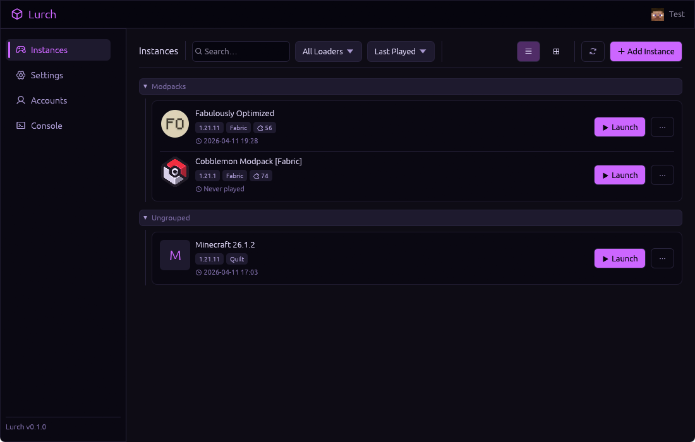

# Lurch

A Minecraft launcher built with Rust and [egui](https://github.com/emilk/egui).



## Features

- **Multiple mod loaders** — Vanilla, Forge, NeoForge, Fabric, Quilt
- **Modpack sources** — Browse and install from Modrinth and CurseForge
- **Microsoft authentication** — Device code flow login
- **Java management** — Automatic runtime detection and download
- **Instance management** — Create, configure, and launch isolated instances
- **Per-instance content** — Manage mods, worlds, shaders, resource packs, and servers
- **Themes** — 33 built-in themes with support for custom user themes
- **Cross-platform** — Linux, Windows, macOS

## Building

Requires [Rust](https://rustup.rs/) (edition 2024).

```sh
git clone https://github.com/abigrock/lurch.git
cd lurch
cargo run --release
```

## Setup

### CurseForge

CurseForge browsing and modpack installation work out of the box with the bundled API key. You can optionally override it with your own key in **Settings** if needed.

## Development

This project is built with significant AI assistance. The architecture, implementation decisions, and code were developed collaboratively with AI tools. Contributions and feedback are welcome regardless — the code is the code.

### Architecture

- **GUI**: eframe/egui (immediate mode)
- **Concurrency**: Background threads with `Arc<Mutex<T>>` polling
- **Persistence**: JSON config/state in platform directories
- **Downloads**: SHA1-verified with reqwest

See the [codemap](codemap.md) for a full architectural overview.

## License

[GPL-3.0](LICENSE)
